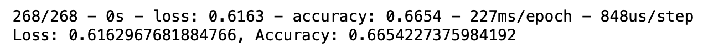
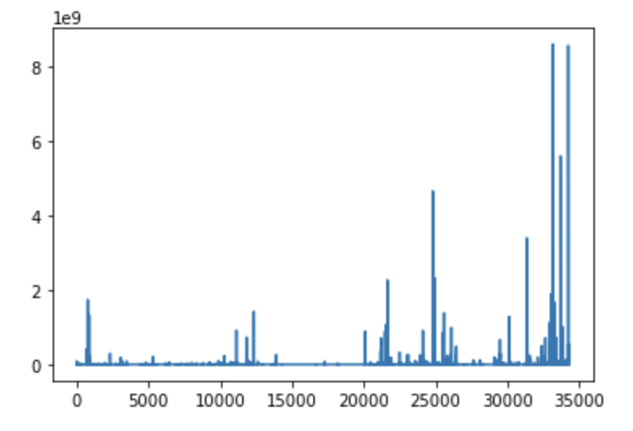

# Neural_Network_Charity_Analysis

## Overview

### Background

Alphabet Soup aims to distribute funds to various non-profits that apply for funding. This dataset includes the success or failure of each endeavor as well as various other attributes of each application that may be relevant to its likelihood of success. These features include:

            * EIN and NAME—Identification columns
            * APPLICATION_TYPE—Alphabet Soup application type
            * AFFILIATION—Affiliated sector of industry
            * CLASSIFICATION—Government organization classification
            * USE_CASE—Use case for funding
            * ORGANIZATION—Organization type
            * STATUS—Active status
            * INCOME_AMT—Income classification
            * SPECIAL_CONSIDERATIONS—Special consideration for application
            * ASK_AMT—Funding amount requested
            * IS_SUCCESSFUL—Was the money used effectively

### Purpose

 The purpose of this analysis is to optimize a binary classifier to make predictions about the success or failure of funding applicants. This analysis uses the TensorFlow library to design a neural network. 

## Results

### Preprocessing

  * Target: IS_SUCCESSFUL 
  * Features: APPLICATION_TYPE, AFFILIATION, CLASSIFICATION, USE_CASE, ORGANIZATION, STATUS, INCOME_AMT, SPECIAL_CONSIDERATIONS, ASK_AMT
  * Excluded variables: The EIN and NAME ID columns were dropped; the ASK_AMT column was also dropped 

## Compiling, Training, and Evaluating the Model 

### Original Model

  * Original model
    * 2 hidden layers (80, 30 units)
    * relu algorithm
    * 160 epochs
    * 

### Updates

#### Update 1:

  * Dropping the ASK_AMT feature (assumed to be noisy) 
      * ASK_AMT plot: 
  * Decreasing limit for lower bin for CLASSIFICATION and APPLICATION features
  * 

#### Update 2:

  * change relu functions to sigmoid; maintained all other parameters
  * 

#### Update 3:
  
  * added 2 hidden layers and increased units for first hidden layer to 3xfeatures (126, 30, 10 10) (total 9785 parameters).
  * all functions set to sigmoid 
  * epochs increased to 200
  * 

## Summary

  * final model achieved 0.70 accuracy (<0.75 standard)
  * Further tweaking inputs (i.e. excluding more irrelevant variables, bucketing) may improve the model as increasing epochs, hidden layers, and units did not dramatically increase performance
  * Using a Support Vector Machine Learning model is appropriate for this binary classification problem and may produce similar or better results and avoid the risk of overfitting by attempting to optimise the above model by increasing epochs and units significantly.
